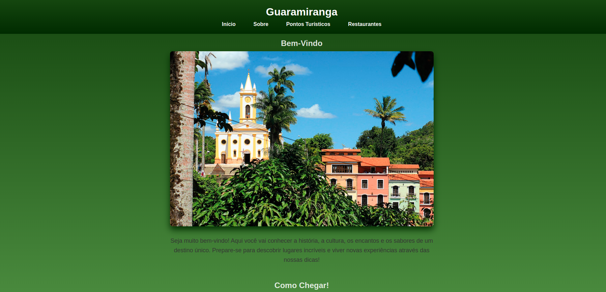
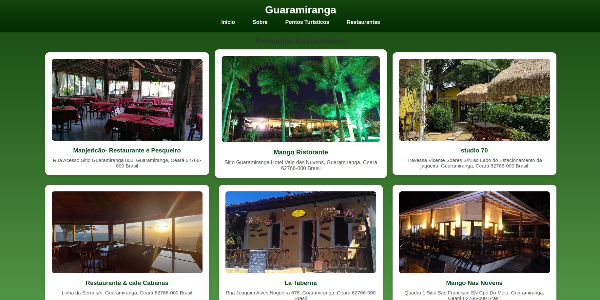

# 🌍 Onde Quero Conhecer

Um site informativo criado com **HTML** e **CSS**, que apresenta detalhes sobre um local específico, incluindo sua história, cultura, pontos turísticos e gastronomia típica.

---

## 🧭 Índice

- [Sobre o Projeto](#sobre-o-projeto)
- [Tecnologias Utilizadas](#tecnologias-utilizadas)
- [Estrutura de Telas](#estrutura-de-telas)
- [Imagens das Telas](#imagens-das-telas)
- [Como Executar](#como-executar)
- [Autor](#autor)

---

## 📌 Sobre o Projeto

O **Onde Quero Conhecer** é um projeto desenvolvido com o objetivo de fornecer informações detalhadas sobre um local específico. Utilizando apenas **HTML** e **CSS**, o site é dividido em quatro páginas principais:

1. **Página Inicial**: Apresenta o nome do local, uma imagem representativa e links para as outras seções.
2. **Sobre**: Fornece uma breve introdução sobre o local, incluindo sua história e aspectos culturais.
3. **Pontos Turísticos**: Lista os principais pontos turísticos com descrições e imagens.
4. **Restaurantes e Comidas Típicas**: Destaca pratos tradicionais e os principais restaurantes locais.

---

## 🛠️ Tecnologias Utilizadas

- HTML5
- CSS3

---

## 🖼️ Estrutura de Telas

O projeto é composto pelas seguintes páginas:

- `index.html`: Página Inicial
- `sobre.html`: Informações sobre o local
- `pontos.html`: Pontos Turísticos
- `restaurantes.html`: Restaurantes e Comidas Típicas
  
As imagens utilizadas estão armazenadas na pasta `/images`, e os estilos estão definidos em `/css/style.css`.

---

## 📸 Imagens das Telas

### Página Inicial



### Sobre


### Pontos Turísticos


### Restaurantes e Comidas Típicas



*Nota: Certifique-se de que as imagens acima estejam corretamente nomeadas e localizadas na pasta `/images`.*

---

## 🚀 Como Executar

1. Clone o repositório: 
   ```
   git clone https://github.com/seu-usuario/onde-quero-conhecer.git
   ```
2. Navegue até o diretório do projeto:
   ```
   cd onde-quero-conhecer
   ```
3. Abra o arquivo `index.html` em seu navegador preferido.

---

## 👨‍💻 Autor

- [@andersonqxd](https://github.com/andersonqxd)


